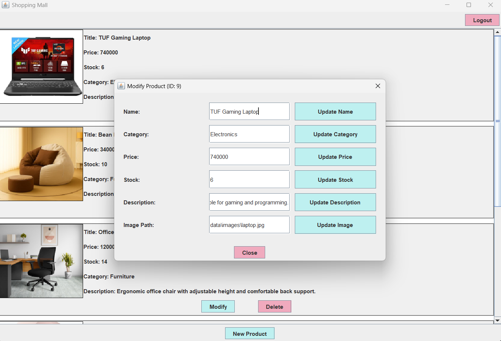
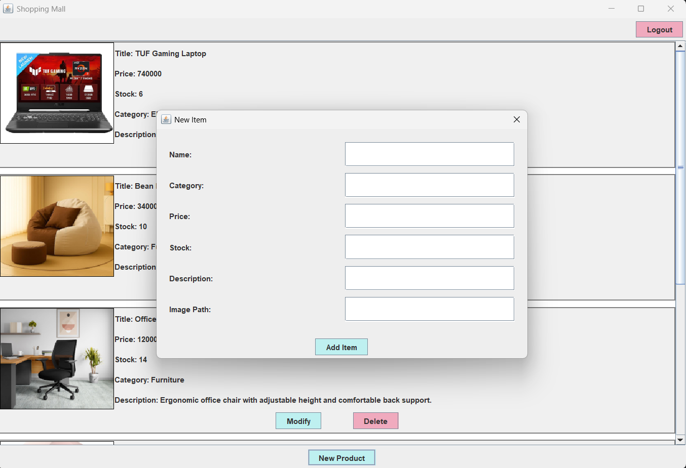
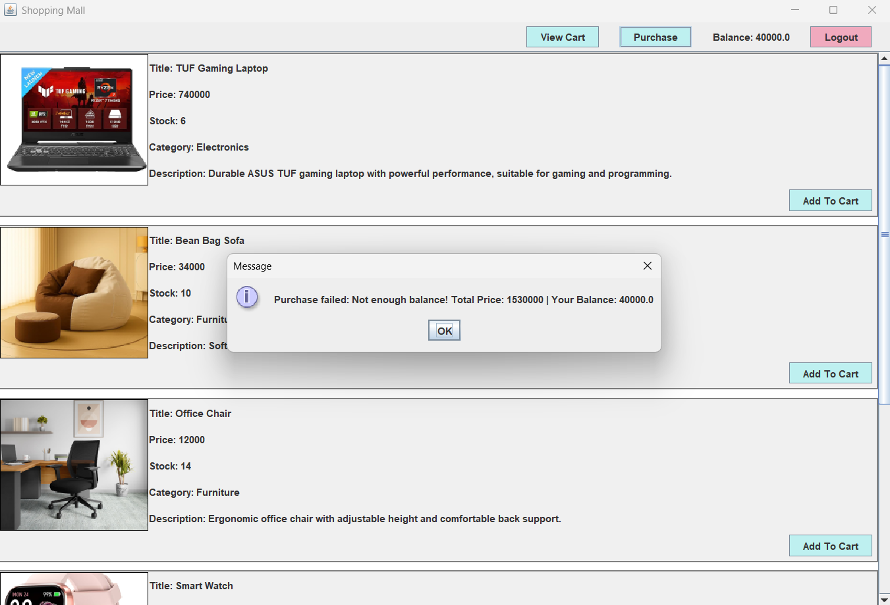

---

---

# Shopping Store Project (Java Swing)

This is a simple shopping store application developed using Java Swing.
The project supports Admin and Customer roles, product management, cart system, and order registration.
All data is stored in JSON files using Gson library.

---

## Features

- User Authentication (Login / Signup)

- Admin Panel for Product Management (Add, Delete, Modify)

- Customer Panel for Shopping

- Cart System (Add / Remove / Increase / Decrease)

- Purchase & Order Registration

- JSON Storage for Users, Products, Orders

---

## Technologies Used

- Java
- Java Swing (GUI)
- Gson (JSON serialization)
- MVC Architecture (Model-View-Controller)
- Repository Pattern
- SHA-256 Password Hashing

---

## How to Run

1. Open the project in IntelliJ IDEA
2. Make sure Gson library is added to the project dependencies
3. Run the `Main.java` file
4. The application will load data from JSON files automatically

---

## Default Admin Account

You can manually add an admin user in `Users.json` file.

Example:
- username: Admin
- password: 33 (stored as SHA-256 hash)

---

## Project Structure

src/
- model/        (User, Customer, Admin, Product, Order, Cart classes)

- view/         (Swing panels, dialogs, UI components)

- controller/   (Event handling and UI logic)

- services/     (Business logic)

- repository/   (Interfaces for data access)

- repository/json_implementation/ (JSON persistence)

data/json_files/
- Users.json
- Products.json
- Orders.json

---

## Architecture (MVC)

- Model: represents data objects such as Product, User, Order, Cart.

- View: Swing panels and dialogs that display UI.

- Controller: connects View actions to Service logic.

- Services: handles business rules and validations.

- Repository: responsible for saving/loading JSON data.

---

## Main Classes and Responsibilities

### Model Package
- User : Base class for all users. Stores shared fields like id, username, passwordHash, and role.

- Admin : Extends User. Represents an admin user who can manage products and view system data.

- Customer : Extends User. Represents a customer with additional fields like balance and cart.

- Product : Represents a store product with information such as id, name, price, and stockQuantity.

- Cart : Represents the shopping cart of a customer and contains a list of cart items.

- CartItem : Represents an item inside a cart, including productId and quantity.

- Order : Represents a placed order containing customer information, total price, date, and order items.

- OrderItem : Represents an item inside an order (product id, quantity, price at purchase time).

### Repository Package

Repositories are responsible for reading and writing data from/to JSON files.

- IUserRepository / JsonUserRepository
  Handles loading and saving users from Users.json.

- IProductRepository / JsonProductRepository
  Handles loading and saving products from Products.json.

- IOrderRepository / JsonOrderRepository
  Handles loading and saving orders from Orders.json.

### Service Package

Services contain the main business logic of the system.

- AuthenticationService
  Responsible for signup/login operations and password hashing validation.

- CustomerServices
  Manages customer-related operations such as updating balance and saving customer data.

- ProductServices
  Manages product operations such as adding, editing, deleting products and updating stock.

- CartServices
  Manages customer cart actions such as add/remove products, clear cart, and calculate total cost.

- OrderServices
  Handles placing orders, validating stock and balance, updating product stock, saving orders, and updating customers.

### Controller Package

Controllers are responsible for connecting the UI (Swing Views) to the business logic (Services).
In this project, all event-handling logic (ActionListeners) is implemented inside controllers to keep the View layer clean.

- AuthenticationController
  Handles login and signup actions.
  Connects the authentication UI to AuthenticationService and validates user credentials.

- ProductController
  Handles admin product management operations such as creating, editing, and deleting products.
  Connects the admin panel UI to ProductServices.

- CustomerController
  Controls the customer product panel.
  Handles actions such as viewing products, adding products to cart, and purchasing orders.

- CartController
  Controls the cart dialog window.
  Handles cart operations such as increasing/decreasing quantity, removing items, and refreshing cart items.

### View Package

The view layer is responsible for the graphical user interface using Java Swing.

- MainFrame
  The main application window. Manages switching between panels and stores the current logged-in user.

- LoginPanel / SignupPanel
  Panels responsible for authentication UI.

- ProductManagementPanel
  Admin panel for viewing and managing product list.

- CustomerProductPanel
  Customer panel for viewing products and purchasing.

- CartDialog
  Dialog window that shows customer cart items and allows cart operations.

